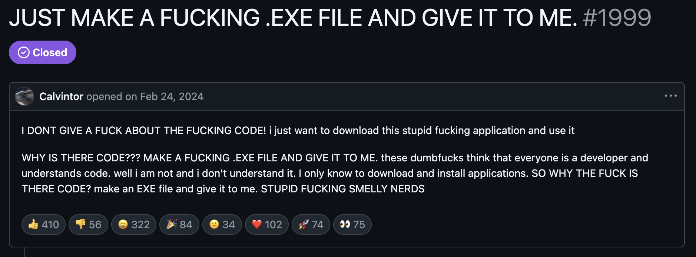
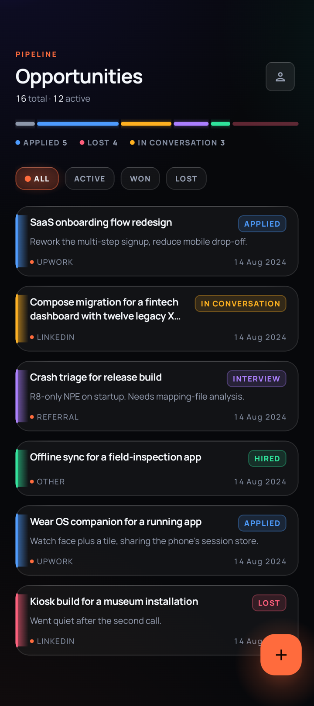
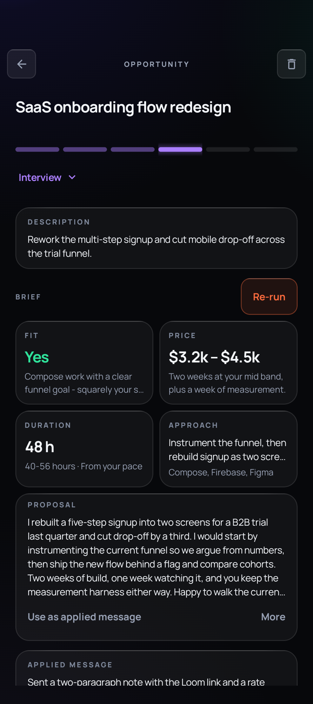
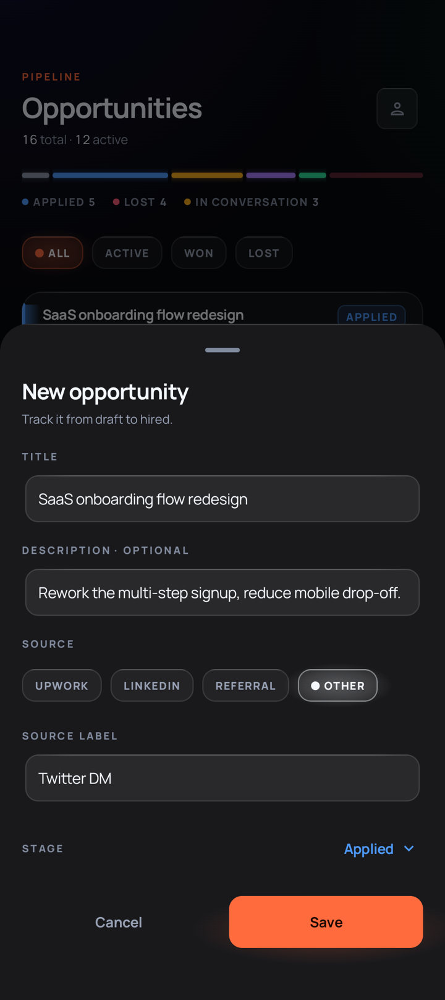
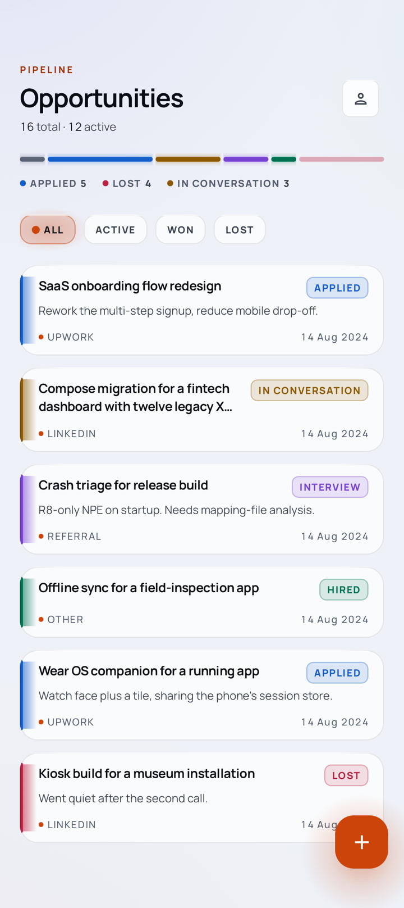
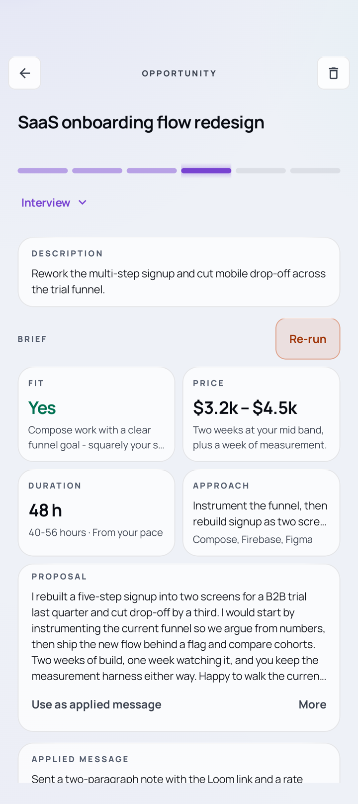
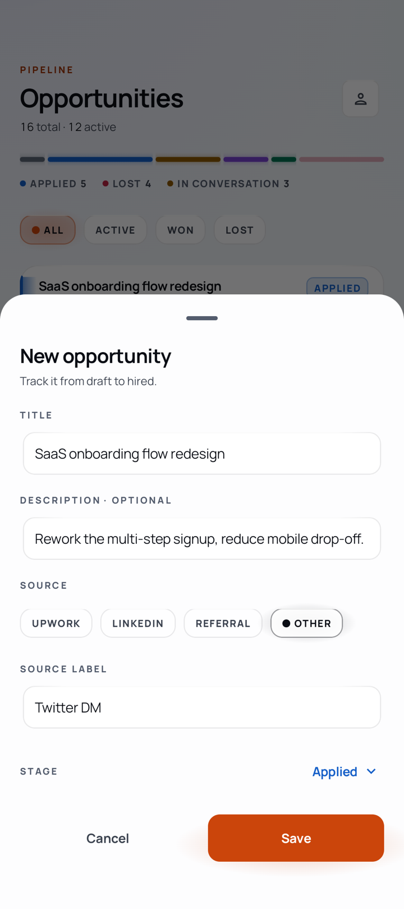

Yeah.


However, you may just like it.

# Traceback

*This app is intentionally small. One pipeline, local storage, one optional OpenAI call.
All additional details are in [Under the hood](#under-the-hood).*

[](https://github.com/Erishan/traceback/actions/workflows/ci.yml)

Closing a deal on your freelance work is not an easy job.
You gotta see what they really want if they want anything,
you send your proposal and wait...
Sometimes they go quiet.
Sometimes they are too hyped and they just jump to a new project.
Sometimes you do not hear from them for three whole weeks and all of a sudden a new opportunity pops up.

Traceback keeps all of it in one place, so you always know what is still alive.

Every opportunity in this big bang dust that we call life has its own stage.

In Traceback every lead gets a stage such as Draft, Applied, In conversation, Interview, Hired,
Delivered. And it moves along as things happen. When one dies, it goes to
Closed or Lost instead of quietly disappearing, which can help you find out what
your real win rate is.

Everything stays on your phone. No account, no Traceback server, no sync.
There is an iOS build too — [how much to trust it](#ios) is spelled out below.

-> fyi the source is only here, there is no app on any store.

## What it looks like

<p align="center">
  
  
  
</p>

<details>
<summary>Light theme</summary>
<p align="center">
  
  
  
</p>
</details>

## What you get

- Add a lead in a few seconds: title, where it came from, what stage it is at.
- Open it later to see how far it got, edit anything inline, and drop dated
  notes as the conversation goes on.
- Filter the list down to what is active, won, or lost.
- Optional: run a structured job brief from the detail screen. One button, your
  OpenAI key, one round trip to `api.openai.com` — fit, price, duration,
  approach, a draft proposal you can paste into the applied-message field.
  Nothing else in the app talks to the network.

## Under the hood

Kotlin Multiplatform. Shared Compose UI on Android and iOS. Room on device.
Navigation 3 on Android and a hand-written back stack on iOS.

| Module | What is in it | Builds for |
|---|---|---|
| `:shared` | Domain, Room, the OpenAI client, manual DI | Android, iOS |
| `:ui` | Aurora theme, components, list, detail, create, Me | Android, iOS |
| `:app` | Android shell: routes, thin ViewModels, previews | Android |
| `:iosCompose` + `iosApp/` | iOS shell: UIKit host, swipe-back | iOS |

Contrast is measured, not eyeballed. 
`tools/contrast_audit.py` fails CI on any text or surface pair below WCAG AA in either theme.

## iOS

The shared core runs on iOS. Same Room schema, same screens, same source.

What it does not get is a native feel. And that is the trade off I have chosen.
The screens are Compose drawn into a UIKit host, so text editing behaviour, selection handles and scroll momentum come from Compose and not from UIKit.
iOS also has no Navigation 3: the back stack and the back swipe are written by hand.
One shared UI is the standing decision.

## Run it

### Android

Open it in Android Studio and hit Run.

```bash
./gradlew installDebug
```

### iOS

Requires a full **Xcode** install (Command Line Tools alone are not enough).
Open [`iosApp/iosApp.xcodeproj`](iosApp/iosApp.xcodeproj), pick a simulator,
and Run. The Xcode build embeds `:iosCompose`, which exports `:shared` and
`:ui`.

```bash
./gradlew :ui:compileKotlinIosSimulatorArm64 :iosCompose:compileKotlinIosSimulatorArm64
```

## License

The application code is licensed under [Apache 2.0](LICENSE); the bundled
Manrope font is licensed separately under the SIL Open Font License 1.1
([docs/licenses/Manrope-OFL.txt](docs/licenses/Manrope-OFL.txt), summarised in
[NOTICE](NOTICE)).
